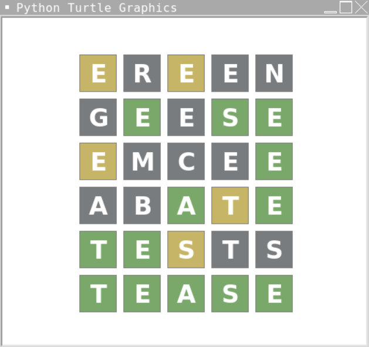

# Wordle by Ty'rese H. — March 2022

\[v1\] Wordle game using console I/O only (not shown, needs fixing).

\[v2.2\] Wordle game using turtle input and Python turtle graphics.
* _added turtle.textinput(), removed console i/o_
* _removed 2d-list of tuples_


### GAME INSTRUCTIONS
Guess a five-letter word within six tries.
Gray/Black highlighting means that the letter is not in the word at all.
Yellow highlighting means that the letter is in the word, but in the wrong spot.
Green highlighting means that the letter is in the word and is in the right spot.

_See documentation and Replit file below._


     

### DATA ORGANIZATION AND VISUALS
```words.txt``` holds words separated by newline characters.

Turtle and ANSI colors are saved as strings.

The ```draw_box()``` function draws a box at ```x,y```, fills it with ```color```, and writes ```text``` (a letter) in the center of the box. For clarity, filling in a box is the same thing as highlighting a letter.


The ```draw_board()``` function uses nested-loops to draw the boxes in a grid format. It only draws the empty board (empty string text, white background).


### COLOR-CODING THE LETTERS IN A GUESS WORD
The ```colorize()``` function determines the color of each box by looping through the letters in ```guess``` and comparing them to those in ```actual```.
It then uses ```draw_box``` to fill in the letters with the proper highlighted color.

```tries``` keeps track of how many guesses a user has made thus far. It is also used to determine which row on the board (height on the screen) the letters in ```guess``` will be placed in. _Example: If a user has made two guesses so far, row two (counting from zero) will be filled in after the next guess is made._

The algorithm to highlight letters is mostly trivial. Each letter in ```guess``` is compared to the corresponding letter from ```actual```. However, there are two edge cases involving duplicate letters that ```colorize()``` accounts for.

**(1) If a letter from ```guess``` is in ```actual``` but is in the wrong spot it would normally be highlighted in yellow. However, if the letter has been used in ```guess``` more times than it exists in ```actual```, it should be highlighted in gray/black. _Example: if the actual word is "TEASE" and the guessed word is "EREEN", there should only be two yellow "E"s, not three. The third "E" should be highlighted in gray/black (see screenshot below)_.**

To account for this, ```lgc``` (letter guess counter) is a dictionary where each key is a letter in the actual word and its value is the number of times that letter has been used in ```guess```. ```lgc[guess[i]] += 1``` increments the count for a given letter.


**(2) If a letter from ```guess``` is in ```actual``` and is in the right spot it should be highlighted in green no matter what, even if it has been used too many times. _Example: if the actual word is "TEASE" and the guessed word is "EMCEE", there should only be one yellow "E", not two. The second "E" should be highlighted in gray/black. Though the last "E" is the third time that "E" is used, it should still be highlighted in green because it is in the right spot (see screenshot below)_.**

To account for this, green highlighting takes priority over yellow and gray/black highlighting. The first ```for i in range(5)``` loop only does green highlighting and counts letter guesses. The second ```for i in range(5)``` skips over green highlighting completely, does yellow and gray/black highlighting, and counts letter guesses.


### MAIN GAME CONTROL
```while True``` is the main loop that runs the game.

### RUN IT YOURSELF

**[Click here to test this game on replit.](https://replit.com/@ty-rese/Wordle-key#main.py)**
**If you find any bugs, please email me at htd.7z@my.com**

Correct output for edge cases:



