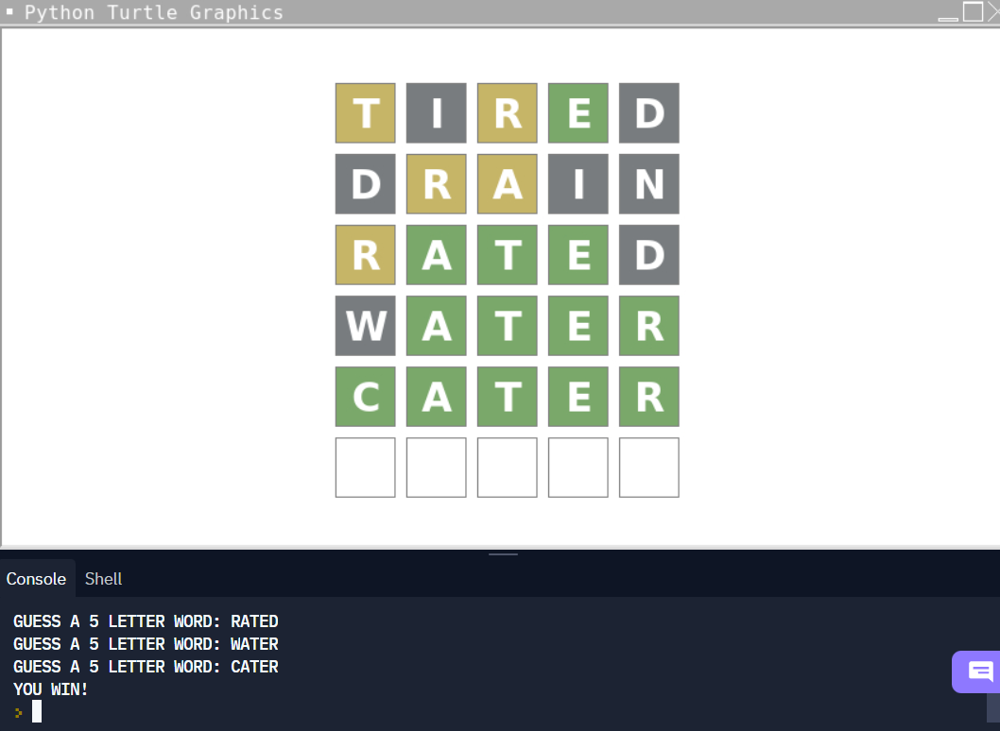

# Wordle by Ty'rese H. — March 2022

Wordle game using Python turtle graphics (v2)

* Use the console to guess a 5-letter word. Try to guess the actual word within 6 tries.
* Black/Gray highlighting means that the letter is not in the word at all.
* Yellow highlighting means that the letter is in the word, but in the wrong spot.
* Green highlighting means that the letter is in the word and is in the right spot.

